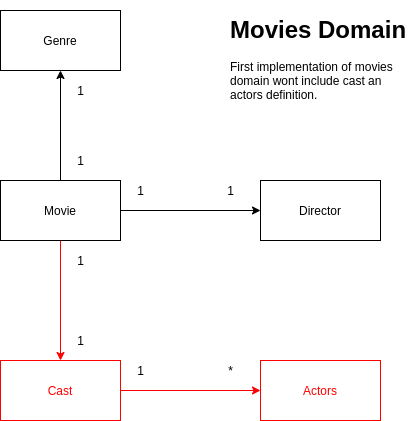

# Admios Flix

* [Architecture](#architecture)
  * [Key components](#key-components)
* [Setup](#setup)
  * [tests](#tests)
  * [API](#api)
  * [Run](#run)
* [TODO](#todo)


## Architecture

This implementation is following hexagonal architecture style, so domain implementation just have 
semantic specification for movies domain, infrastructure layer implements adapters such as postgres 
repository implementation and redis implementation (authentication purposes). 

This implementation is made in **Scala** using functional approach.

As you can see there is a definition of **F[_]** that means some effect type. 
this allows use several ways to inject several effect types (cats effects IO, Task monix, Scala ZIO) easily.

### Domain



Domain model in his first implementation are not going to implement cast definition
neither actors, because the core idea is maintaining simplicity.

Architectural decisions

- Domain objects are instantiated using companion object pattern, that means
  at the moment to create a new one make sure that is a valid instance, 
  leveraging in [cats validated](https://typelevel.org/cats/datatypes/validated.html) definition
- Types matter: To avoid problems like `class Obj(a: String, b: String)` where we could pass swapped data
  `Class Obj(a = "Value B" , b = "Value A" )` this compiles, and it's a potential source of bugs, the implementation
  uses strong type definition `Clas Obj(a: A, b: B) where a,b has primitive values String, Int ect` that allows check type
  errors in compiling type.
- Domain services provide an abstraction that indicates way to have to make the implementation i.e 
  a specification that desired behavior, in other words provide a powerful extensible and maintainable way 
  to support business services. Also is highly testable because you could provide an implementation of that 
  services for testing purposes (avoiding mocks.)

### Key components

- **Postgres** to store data related to movies (CRUD implementation) look sql [scripts](core/src/main/resources/db/migration/V1.0__create_tables.sql)
- **Redis** Mechanism to store authentication tokens
- **circe config** provide way to read application configuration via [application.conf](core/src/main/resources/application.conf) file 

## Setup

Before to start is required have installed.
- java 1.8 or higher
- sbt
- postgres (container works)
- redis (container works)

As you can see there is an application.conf file, there are some values that could be defined when the application
is going to start, for example in docker-compose file or in config map for kubernetes.

### tests
go to _admios-flix_ folder ant type
```bash
  sbt test;it:test
``` 

### API

To play with the API without insert real data I provide a swagger implementation 
type `sbt swagger/run` this start a http server, take a look the default [setup](swagger/src/main/resources/application.conf)

to check yaml generated go to `http://127.0.0.1:8081/swagger/movie/swagger.yaml` 

This demonstrates the domain services are easily maintainable and extensible because we could provide a swagger 
implementation, and use it as a playground.

Also, we can create a docker image for that, follow the instructions to run the app. 

### Run

1. you need generate docker image, for testing purposes

if you have sbt installed 
```bash
  sbt docker:publishLocal
``` 

If you don't have sbt installed use this [dockerfile](Dockerfile) to be able to create a docker image
```bash
  docker build -t app-scala .
  docker run  --rm -v /var/run/docker.sock:/var/run/docker.sock -it --name my-scala-app app-scala
``` 

**note:**
to create an image without sbt installed we need enable docker socket, because this setup is using 
a sbt plugin to generate images

it generates the image `admios-flix:1.0.0-SNAPSHOT`  and `admios-flix-swagger:1.0.0-SNAPSHOT`

also, it's possible publish the image in a remote image repository not defined yet  

2. go to [app](app/docker-compose.yaml) folder, within it, you found docker-compose file
  type `docker-compose up --build`

   1. Use scripts files
      1. go to [app scripts](app/scripts)
      2. create a new user `sh create_user.sh` the user info is in [new_user.json](app/scripts/new_user.json)
      3. If you have user created `sh login.sh`
      4. With the token received set env var `export USER_TOKEN={value received in 2 or 3}`
      5. here you have CRUD operations take a look scripts files
      ```
      note:
       get movies allows receive paginated response, also is valid apply 
      filters by genres that means &genre=G1&&genre=G2 is a valid filter 
      ``` 
## TODO

- [ ] Use testcontainers in integration test
- [ ] Include authentication services in swagger 
- [ ] Flyway integration
- [ ] Logging 
